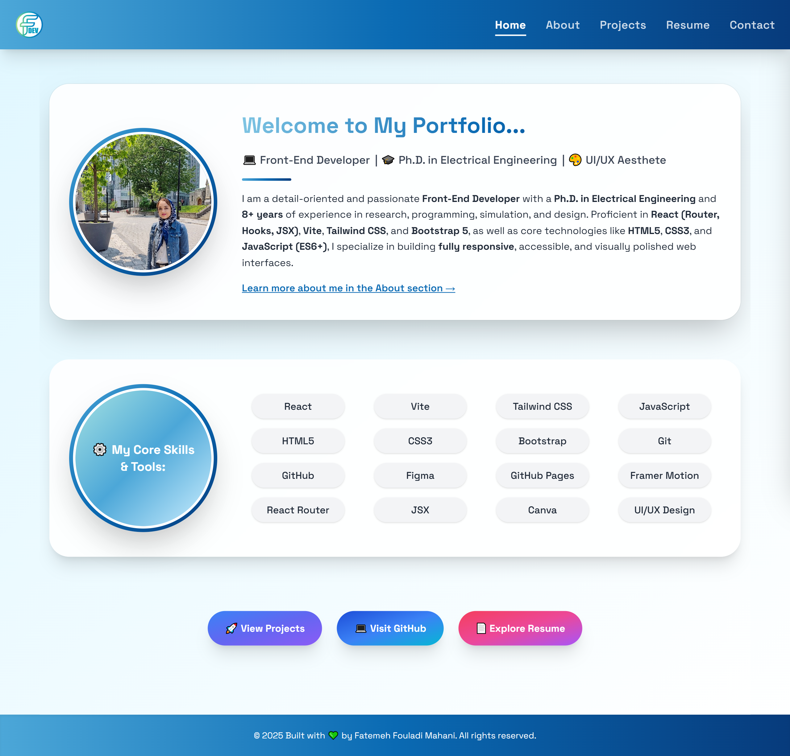

# 🎨 Personal Portfolio Website

A fully responsive and elegant portfolio website developed to present my personal projects, academic achievements, and frontend development skills.

Built using **React**, **React Router**, **Tailwind CSS**, and **Framer Motion**, this site showcases a deep focus on clean UI design, modular component architecture, and performance-optimized responsiveness across all screen sizes.



## 🌐 Live Preview

🔗 [View Live Site](https://ffmahani.github.io/my-portfolio)

---

## ✨ Highlights

- 🎯 **Modern Hero Section**  
  Two-column layout with animated intro, CTA buttons, and skill badges

- 💬 **Dynamic About Section**  
  Scroll-based animations, tech stack summary, education, awards, and soft skills

- 🧩 **Modular Code Architecture**  
  Clean folder structure using `components/`, `hooks/`, `pages/`, `layout/`, and `routes/`

- 🌀 **Smooth Transitions & Hover Effects**  
  Using **Framer Motion** + **Tailwind** for subtle motion and interactivity

- 📱 **Fully Responsive Layout**  
  Built with `rem`/`em` units and Tailwind media queries — works seamlessly across mobile, tablet, and desktop

- 📄 **Resume & GitHub Integration**  
  Downloadable frontend & engineering CVs + direct GitHub project links

- 📩 **Contact Form with EmailJS**  
  Fully functional contact form that sends real messages using EmailJS

---

## 🛠️ Built With

- [React](https://reactjs.org)
- [Vite](https://vitejs.dev)
- [React Router (HashRouter)](https://reactrouter.com)
- [Tailwind CSS](https://tailwindcss.com)
- [Framer Motion](https://www.framer.com/motion/)
- [EmailJS](https://www.emailjs.com)
- [TypeAnimation](https://www.npmjs.com/package/react-type-animation)

---

## 🗂️ Folder Structure

```
src/
├── assets/              # Images, icons
├── components/          # Reusable components (Navbar, Footer)
├── hooks/               # Custom hooks (e.g., useScrollToTop)
├── layout/              # Page layout wrapper
├── pages/               # Route-level pages (Home, About, Contact, etc.)
├── routes/              # Centralized route definitions
├── App.jsx              # Main routing logic
├── main.jsx             # Vite entry point
├── index.css            # Tailwind and global styles
```

---

## 🧠 Author

**Fatemeh Fouladi Mahani**  
Frontend Developer | Ph.D. in Electrical Engineering | UI/UX Enthusiast  
🔗 [LinkedIn](https://linkedin.com/in/fatemeh-fouladi-mahani) • [GitHub](https://github.com/FFMahani)

---

## 📜 License

This project is licensed under the [MIT License](LICENSE) — feel free to fork and customize!
